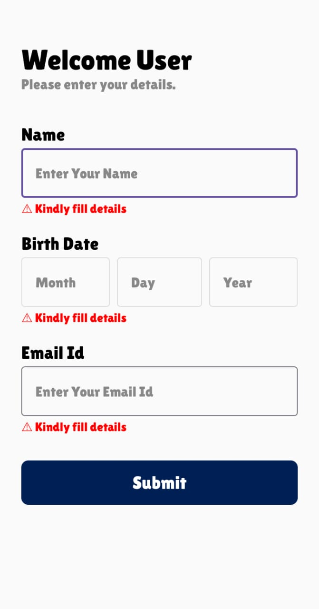
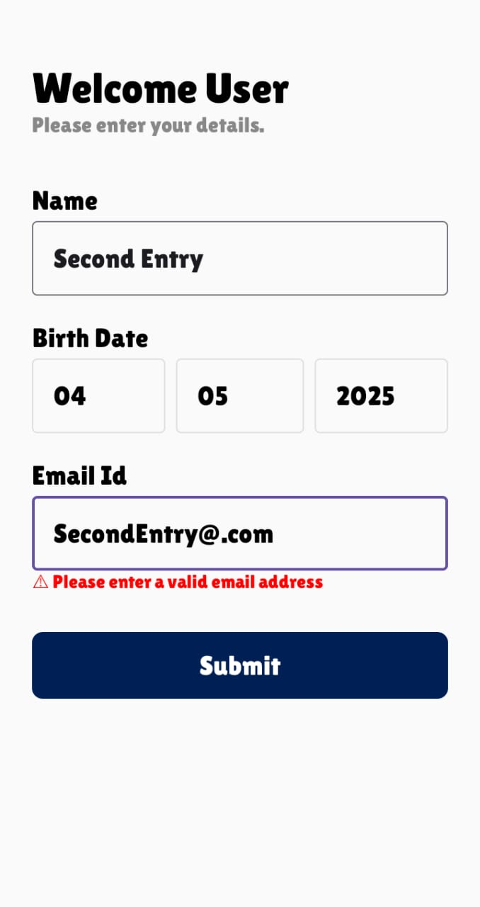
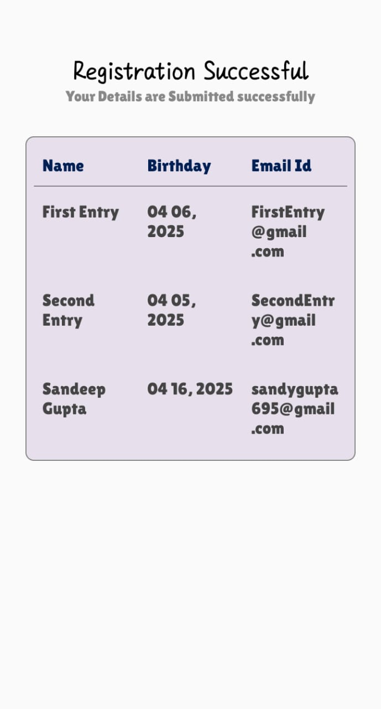

# 📱 Android Registration App

This is a simple Android app built using **Android Studio** and **Jetpack Compose** that demonstrates how to create a user registration screen and display submitted user data on a second screen. The data is stored using an in-memory `ArrayList`.

---

## ✅ Features

- ✍️ User Registration Form (Name, Date of Birth, Email)
- 📤 Data Submission with Validation
- 📄 View All Submitted User Entries
- 📦 In-memory storage using `ArrayList` (easy to migrate to SQLite)

---

## 🏗️ Tech Stack

- Kotlin
- Jetpack Compose
- Android Studio
- Material 3

---

## 📸 Screenshots

<table>
  <tr>
    <th>Error Screen</th>
    <th>Final Submitted Screen</th>
    <th>List of Registered Users</th>
  </tr>
  <tr>
    <td></td>
    <td></td>
    <td></td>
  </tr>
</table>

---

## 🚀 How It Works

### 🔹 Activity 1 - Registration Screen
- Users enter:
  - Name (only alphabets allowed)
  - Date of Birth (via Date Picker)
  - Email ID (validated using regex)
- On clicking **Submit**, the form is validated.
- If valid, the user data is stored in a shared `ArrayList` and navigates to the second screen.

### 🔹 Activity 2 - User Display Screen
- All registered users’ details are shown in a tabular format.
- Data is fetched from the shared `UserStore` object.

---

## 🧪 Validation Rules

- **Name**: Must only contain alphabets and spaces.
- **Email**: Must follow standard email pattern.
- **Date of Birth**: Cannot be empty.

---

## 📥 Download Demo App

Want to try it out? Download the APK and install it on your Android device:

👉 [**Download the app**](app-debug.apk)

> Make sure to enable "Install from Unknown Sources" in your phone settings before installing.
---
